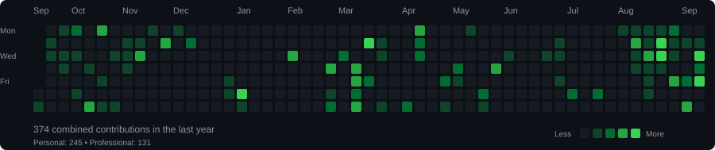

# Vishal Kumar

**Full-Stack Engineer | AI/ML | Automation | React | React Native**

I build production-oriented software at the intersection of full-stack engineering, AI, mobile, and automation. My work spans scalable web platforms, ML-powered systems, AI automation workflows, and mobile applications.

Currently working with MERN, React Native, Python, AI/LLM APIs, cloud technologies, and automation platforms.

[LinkedIn](https://www.linkedin.com/in/vishal-kumar2606/) | [Portfolio](https://www.vishaljaiswal.tech/) | [GitHub](https://github.com/vk26kumar) | [Professional GitHub](https://github.com/vishalk-spektra) | [Email](mailto:vkumar26062003@gmail.com)

---

## About

- Computer Science and Engineering at MMMUT, Gorakhpur with a CGPA of 9.28/10
- Building MMMUT.XYZ, an academic platform used by 5,000+ students
- Experience across full-stack development, AI/ML, automation, and enterprise software
- Interested in AI agents, intelligent automation, scalable SaaS, and production systems
- Building web and mobile applications using React, React Native, Node.js, and Firebase
- Exploring AWS, Docker, cloud architecture, and system design

---

## Engineering Stack

**Languages**

`JavaScript` `TypeScript` `Python` `C/C++` `Java` `HTML` `CSS`

**Frontend and Mobile**

`React.js` `React Native` `Expo` `Tailwind CSS` `Bootstrap` `Material UI`

**Backend and Data**

`Node.js` `Express.js` `MongoDB` `MySQL` `REST APIs` `Firebase`

**AI and Machine Learning**

`Scikit-learn` `TensorFlow` `NumPy` `Pandas` `NLP` `LLM APIs` `AI Agents`

**Cloud and DevOps**

`AWS` `Docker` `Vercel` `Render` `GitHub Actions`

**Tools and Platforms**

`Git` `GitHub` `Postman` `Figma` `n8n` `Passport.js` `Razorpay`

---

## Impact

| Metric | Result |
| --- | --- |
| Students served | 5,000+ |
| IDPS accuracy | 99.0% |
| IDPS AUC-ROC | 99.7% |
| B.Tech CSE CGPA | 9.28/10 |
| GDG Hackathon | 4th place |
| Code for Bharat | Pre-final round |

---

## GitHub Activity

My engineering work is maintained across personal and professional GitHub accounts.

**Personal:** [vk26kumar](https://github.com/vk26kumar)  
**Professional:** [vishalk-spektra](https://github.com/vishalk-spektra)

> Combined activity across my personal and professional GitHub accounts.

---

## Connect

I am interested in full-stack engineering, AI/ML, automation, SaaS, and production systems.

[LinkedIn](https://www.linkedin.com/in/vishal-kumar2606/) | [Portfolio](https://www.vishaljaiswal.tech/) | [GitHub](https://github.com/vk26kumar) | [Professional GitHub](https://github.com/vishalk-spektra) | [Email](mailto:vkumar26062003@gmail.com)

---

Building useful systems, learning continuously, and shipping.
